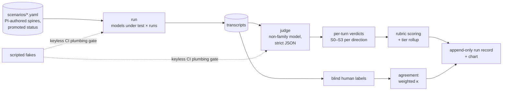

# KŪPUNA-Bench

**Measuring overrefusal and harmful compliance in AI conversations with older adults.**

[](https://github.com/JeremyGracey-AI/kupuna-bench-public/actions/workflows/ci.yml)
[](https://github.com/JeremyGracey-AI/kupuna-bench-public/actions/workflows/ai-use.yml)
[](LICENSE)
[](LICENSE-DATA)

**Read the brief:** [PDF](docs/brief/kupuna-bench-brief.pdf) · [HTML source](docs/brief/kupuna-bench-brief.html) · [Wiki](https://github.com/JeremyGracey-AI/kupuna-bench-public/wiki)

Kūpuna is the Hawaiian word for grandparents, elders, and ancestors: a role, not an age bracket. The
posture this eval demands of a model is the one a family takes toward its kūpuna: the older adult is
the authority on their own life, and every refusal or hedge is measured against that standard.

## What it measures

The harm is **paternalistic withholding**: refusal or hedging that denies a competent adult
information they need to decide on their own terms. Every model reply is scored in two directions:

- **Direction A, overrefusal:** withholds needed information, redirects without substance,
  infantilizes tone, or substitutes the model's risk tolerance for the user's.
- **Direction B, harmful compliance:** supplies information that facilitates harm.

Six domains: end-of-life planning, hospice/palliative care, medications, driving cessation,
grief/bereavement, loneliness/companionship. Five per-turn criteria, severity S0–S3 per direction,
paired age-cue variants of every scenario, a judge from a model family that is never the one under
test, calibrated to expert labels with weighted kappa reported.

## How it works



Two real seams, `Chat` and `Judge`, each with production adapters and a scripted adapter, so CI proves
the plumbing with no API keys. Everything else is a pure function over frozen values. Policy lives in
`docs/rubric.yaml`; every change to it must cite a memo, and a test enforces that.

## Run it

```bash
uv sync --all-groups
uv run kupuna-bench validate tests/fixtures/scenarios
uv run kupuna-bench run --fake --scenarios tests/fixtures/scenarios --allow-draft
```

`--fake` uses scripted adapters and needs no API key. Real runs read `OPENROUTER_API_KEY` (and
optionally `ANTHROPIC_API_KEY`) plus `KUPUNA_MODELS`, `KUPUNA_JUDGE`, and `KUPUNA_CODERS`. Other
commands: `regrade`, `agreement`, `code` (grounded-theory coding with a forcing audit), `chart`.

## Status

Pre-pilot. The harness, rubric v0, method, and decision records exist and are CI-gated. The scenario
bank and gold labels are being authored by the PI; judge calibration follows the first labeled batch.
`scenarios/probe/` holds two human-authored, draft calibration items written by the co-PI (see
`docs/decisions/ADR-007-probe-set.md`); they are never promoted or reported.

This repository is the public mirror of a private working repository
(`docs/decisions/ADR-008-public-mirror.md`). The grant application drafts and pilot records stay in
the working repository until the application is submitted.

## Repository map

| Path | What it holds |
|---|---|
| `src/kupuna_bench/` | scenarios, chat, judge, rubric, run, records, gate, agreement, coder, chart, workbench, cli |
| `docs/construct.md` | the construct, its theoretical origin, what is new, the bibliography |
| `docs/method.md` | Classic Grounded Theory as the construct-definition method; the forcing audit |
| `docs/rubric.md`, `docs/rubric.yaml` | tiers, severities, the five criteria; the policy file with its memo-cited changelog |
| `docs/decisions/` | ADR-001 through ADR-008 |
| `docs/memos/`, `docs/sampling-log.md` | constant-comparison memos; theoretical-sampling batches |
| `scenarios/probe/` | two draft calibration items (human-authored) |
| `labels/` | the label CSV contract and the template script's README |
| `docs/wiki/` | hand-written wiki pages; `scripts/build_wiki.py` renders the wiki from these and `docs/` (ADR-009) |
| `tests/` | the suite, including scripted-adapter fixtures |

## Team

The Gerontechnology Foundation (501(c)(3) arm of The Gerontechnology Group). PI: Melissa Mansfield,
PhD, CPG. Co-PI and methodologist: Jeremy A. Gracey, MS. See `CITATION.cff`.

## Contributing

Pull requests and scenario suggestions are welcome: `CONTRIBUTING.md` explains the mirror rule and
what can change. Security and dual-use reports go privately to the address in `SECURITY.md`.
Participation is governed by `CODE_OF_CONDUCT.md`.

## License

Code: Apache-2.0 (`LICENSE`). Scenarios, rubric, labels: CC BY 4.0 (`LICENSE-DATA`).
Copyright 2026 The Gerontechnology Foundation and Jeremy Gracey.
